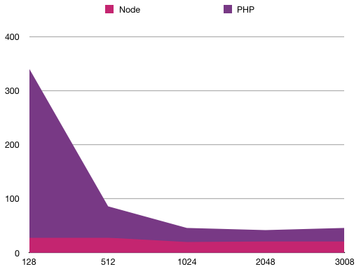
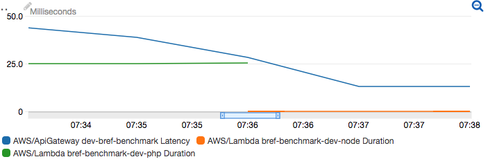

Benchmark for Bref and AWS Lambda.

## Results

This is a comparison of the HTTP response time from an EC2 machine in the same region, on both a NodeJS lambda (`node.js`) and a PHP lambda (`bref.php`). This is not the lambda's execution time but the real HTTP response time.

I run the test 3 times for each combination and I keep the lowest one. When in doubt I run a 4th or 5th measurement.

| Memory | Node lambda | PHP lambda |
|--------|-------------|------------|
| 128M   |        28ms |      340ms |
| 512M   |        28ms |       86ms |
| 1024M  |        20ms |       46ms |
| 2048M  |        21ms |       42ms |
| 3008M  |        21ms |       46ms |

We can see that Node performances are pretty consistent, whereas PHP performances become optimal above 1024M. Performances with 512M can be acceptable depending on the use case (e.g. workers, crons, etc.). 128M performances are pretty poor.

**To sum up, we should expect a 20ms penalty to using PHP over AWS Lambda compared to other languages.**

What's interesting to note is that Node's 21ms base response time is because of the HTTP layer (API Gateway and network). Let's consider this other graph (Cloudwatch metrics):

- blue line: HTTP response time (~40ms for PHP, 13ms for Node)
- green line: PHP execution time (25ms)
- orange line: Node execution time (0ms)

This confirms that PHP adds 20ms-25ms to the lambda's execution time. The HTTP layer (API Gateway) adds ~15ms in all cases. The network between the lambdas and the EC2 machine used for the tests accounts for ~5ms.

## Reproducing

- clone the repository
- `composer install`
- `vendor/bin/bref deploy`

Start a EC2 machine in the same region and SSH into it.

- Install [wrk](https://github.com/wg/wrk): [instructions](https://github.com/wg/wrk/wiki/Installing-wrk-on-Linux#centos--redhat--fedora) (this is because `ab` [doesn't work](https://forums.aws.amazon.com/thread.jspa?threadID=193615))
- Benchmark using `wrk -t 1 -c 1 -d 5s <the-lambda-url>` (run twice or more to warmup)

To get the URL of the lambdas run `vendor/bin/bref info`.

Run benchmarks on both the `/php` URL and the `/node` URL to compare. Change the memory setting in `serverless.yml`, deploy again and benchmark again.

## TODO

Change `serverless.yml` to deploy every combination as a separate function (Node 128M, Node 512M, PHP 128M, etc.). That will allow to run the benchmarks without having to redeploy, and in more consistent conditions between each test.
